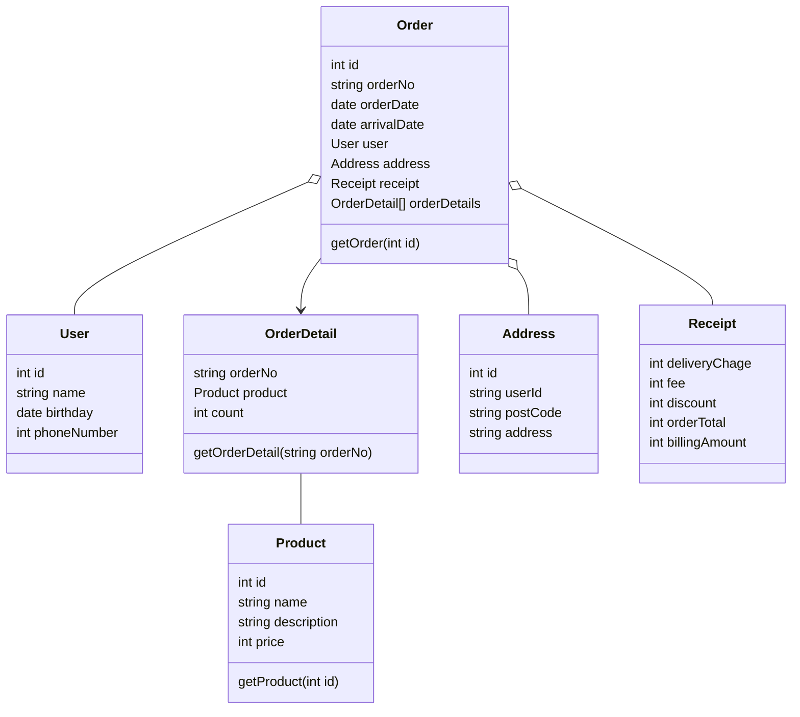

```mermaid
classDiagram

class Product {
  int id
  string name
  string description
  int price
  getProduct(int id)
}

class User {
  int id
  string name
  date birthday
  int phoneNumber
}

class Order {
  int id
  string orderNo
  date orderDate
  date arrivalDate
  User user
  Address address
  Receipt receipt
  OrderDetail[] orderDetails
  getOrder(int id)
}

class OrderDetail {
  string orderNo
  Product product
  int count
  getOrderDetail(string orderNo)
}

class Address {
  int id
  string userId
  string postCode
  string address
}

class Receipt {
  int deliveryChage
  int fee
  int discount
  int orderTotal
  int billingAmount
}

OrderDetail -- Product
Order o-- User
Order o-- Address
Order --> OrderDetail
Order o-- Receipt

```