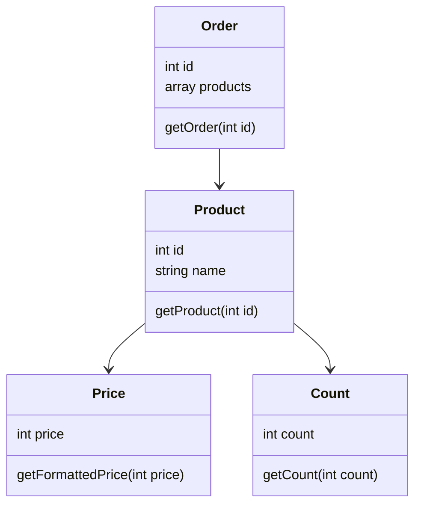

```mermaid
classDiagram
class Product {
  int id
  string name
  getProduct(int id)
}
class Count {
  int count
  getCount(int count)
}
class Price {
  int price
  getFormattedPrice(int price)
}
class Order {
  int id
  array products
  getOrder(int id)
}
Order --> Product
Product --> Price
Product --> Count
```