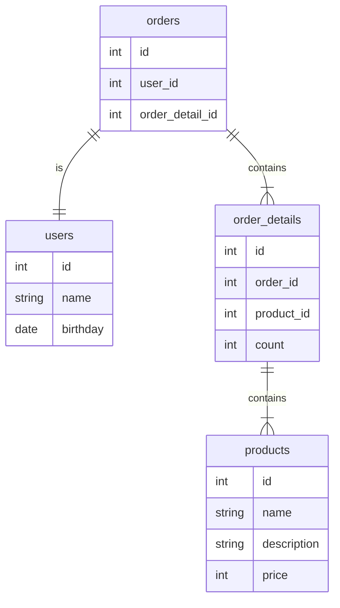

```mermaid
erDiagram

products {
  int id
  string name
  string description
  int price
}

users {
  int id
  string name
  date birthday
}

orders {
  int id
  int user_id
  int order_detail_id
}

order_details {
  int id
  int order_id
  int product_id
  int count
}

orders ||--|{ order_details: contains
orders ||--|| users: is
order_details ||--|{ products: contains
```