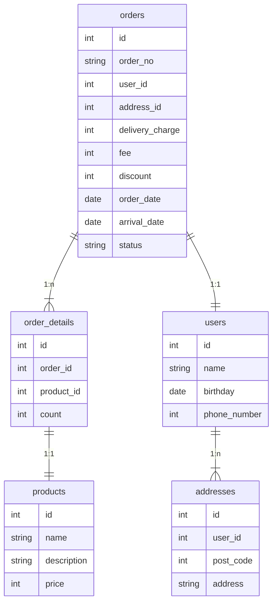

```mermaid
erDiagram

products {
  int id
  string name
  string description
  int price
}

users {
  int id
  string name
  date birthday
  int phone_number
}

addresses {
  int id
  int user_id
  int post_code
  string address
}

orders {
  int id
  string order_no
  int user_id
  int address_id
  int delivery_charge
  int fee
  int discount
  date order_date
  date arrival_date
  string status
}

order_details {
  int id
  int order_id
  int product_id
  int count
}

orders ||--|{ order_details: "1:n"
orders ||--|| users: "1:1"
users ||--|{ addresses: "1:n"
order_details ||--|| products: "1:1"
```