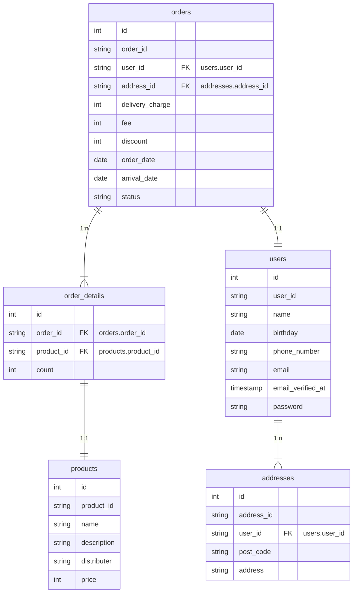

```mermaid
erDiagram

products {
  int id
  string product_id
  string name
  string description
  string distributer
  int price
}

users {
  int id
  string user_id
  string name
  date birthday
  string phone_number
  string email
  timestamp email_verified_at
  string password
}

addresses {
  int id
  string address_id
  string user_id FK "users.user_id"
  string post_code
  string address
}

orders {
  int id
  string order_id
  string user_id FK "users.user_id"
  string address_id FK "addresses.address_id"
  int delivery_charge
  int fee
  int discount
  date order_date
  date arrival_date
  string status
}

order_details {
  int id
  string order_id FK "orders.order_id"
  string product_id FK "products.product_id"
  int count
}

orders ||--|{ order_details: "1:n"
orders ||--|| users: "1:1"
users ||--|{ addresses: "1:n"
order_details ||--|| products: "1:1"
```